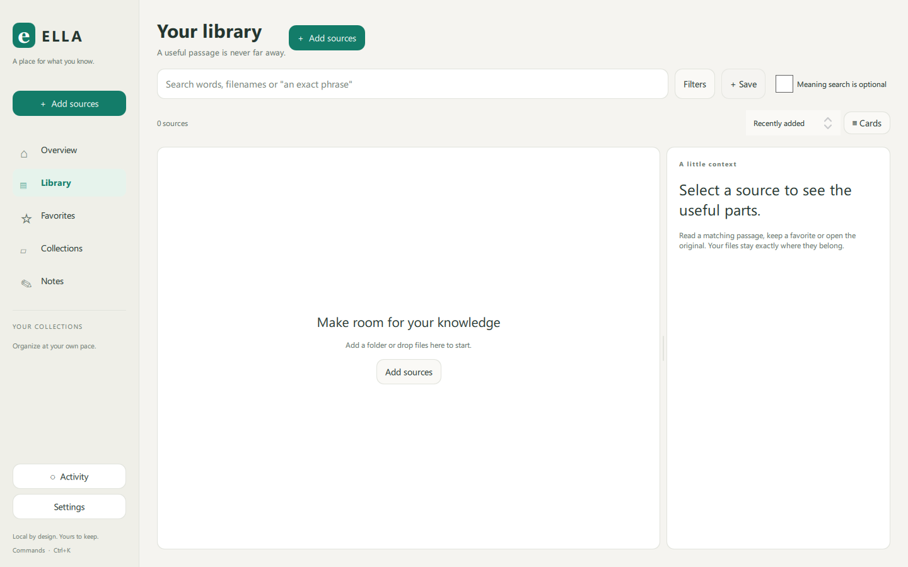
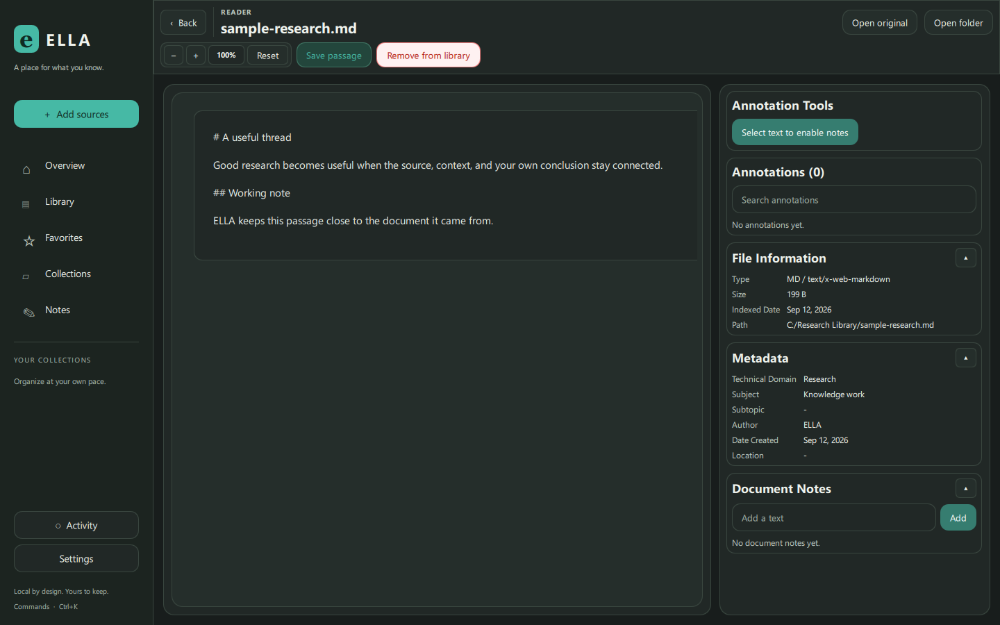

# ELLA


ELLA is a private, local-first research library for Windows. Add the folders you
already use, search the words and passages inside them, open a result in context,
and keep the insight as a source-linked Markdown note.

The core app needs no account, subscription, internet connection, Python runtime,
LibreOffice, or media toolkit. Original files remain in their current locations.
Optional OCR, Office rendering, transcription, media, and semantic-search tools
are installed or selected only after an explicit user action.

## What works in the 1.0 release candidate

- Watched folders, drag-and-drop imports, exclusions, previews, persistent jobs,
  pause/resume/cancel, periodic reconciliation, move detection, missing-source
  relinking, exact-duplicate review, and undoable library removal.
- Debounced asynchronous SQLite search with phrases, filename/content matches,
  filters, SQL sorting and pagination, saved searches, favorites, recent queries,
  and recently opened sources.
- Stable file IDs and passage anchors for PDF pages, DOCX paragraphs, PPTX slides,
  text offsets, and transcript timestamps.
- PDF, image, text, and Markdown reading; lightweight DOCX/PPTX XML extraction;
  annotations, restored reading position, source-linked notes, tags, collections,
  and backlinks.
- Atomic Markdown note saving, knowledge export, full catalog backup/restore,
  pre-migration backups, local-history controls, cache controls, and redacted
  diagnostics.
- A light/dark library workspace, results-and-preview layout, onboarding, activity
  drawer, command palette, keyboard navigation, visible focus, and reduced motion.
- A verified optional-component manager and a native ONNX Runtime + HNSW semantic
  helper build target. The core keeps keyword search available if that helper fails.
- Clean runtime staging, portable ZIP and Inno Setup output from one manifest,
  per-file hashes/sizes, SPDX inventory, and enforced size ceilings.

See the [supported-format matrix](docs/supported-formats.md),
[optional-component policy](docs/optional-components.md), and
[release engineering guide](docs/release-engineering.md).

## A quick look





The [short visual walkthrough](docs/demo.md) covers onboarding, retrieval,
reading, notes, and ownership settings.

## Build on Windows

ELLA pins Qt 6.11.1 and MinGW 13.1 x64. Qt 6.11 publishes Qt PDF
through its extensions repository; CI installs the pinned, verified archive with
`scripts/install_qt_pdf_extension.ps1`. The Windows CI bootstrap also carries a
small, guarded compatibility patch for the unreleased fix to aqtinstall's Qt
6.11 Windows repository mapping.

```powershell
cmake -S . -B build-dev -G "MinGW Makefiles" `
  -DCMAKE_BUILD_TYPE=Debug `
  -DELLA_RELEASE_VERSION=1.0.0-dev `
  -DELLA_RELEASE_CHANNEL=dev `
  -DELLA_BUILD_ID=local-dev
cmake --build build-dev -j 4
ctest --test-dir build-dev --output-on-failure -C Debug
```

Run `build-dev\appSecondBrain.exe`. The historical executable name remains for
upgrade compatibility; the product name shown to users is ELLA.

Create a release candidate with:

```powershell
./scripts/beta_release.ps1 -Version 1.0.0-rc.1
```

The historical script name is retained for existing automation. It never copies
the repository `tools/` directory into a release.

## Project structure

- `src/library`: catalog persistence and background library jobs
- `src/search`: extraction, indexing, keyword search coordination, semantic client
- `src/notes`: Markdown notes and bibliography/backlink handling
- `src/components`: verified optional tools and the isolated semantic helper
- `src/ui`: shared tokens/components and the QML product surfaces
- `packaging` and `scripts`: explicit runtime manifest and release checks

## Contributing

Read [CONTRIBUTING.md](CONTRIBUTING.md) and the
[Windows developer setup](docs/developer-setup-windows.md). Submit focused pull
requests with relevant tests. CI builds Debug and Release, runs the backend and
workspace suites, validates hostile optional-component archives, and checks the
lean core package.

Report security problems privately as described in [SECURITY.md](SECURITY.md).

ELLA is licensed under Apache-2.0. Dependencies and optional models retain their
own licenses; see [third-party notices](docs/THIRD-PARTY-NOTICES.md).
