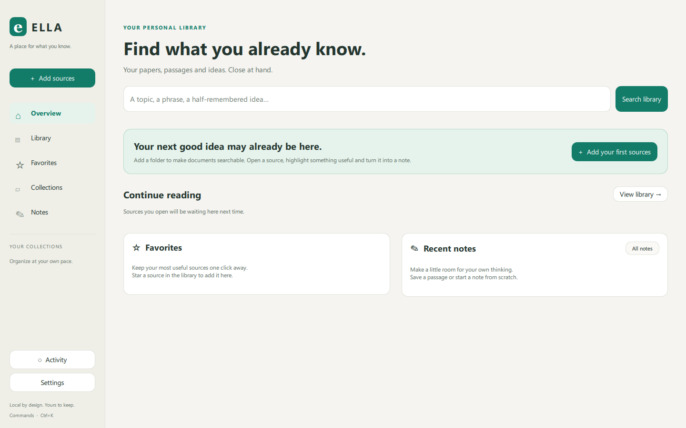
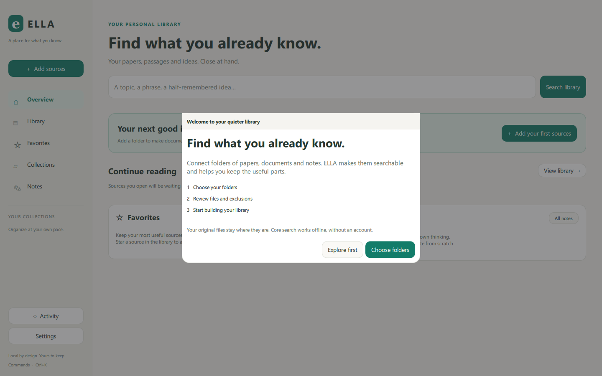
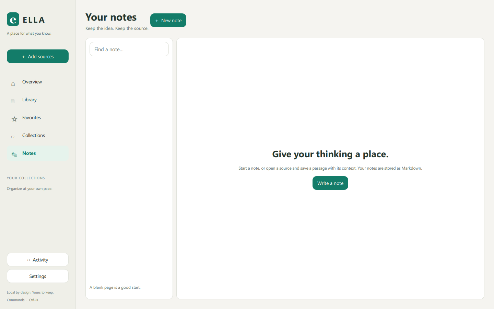
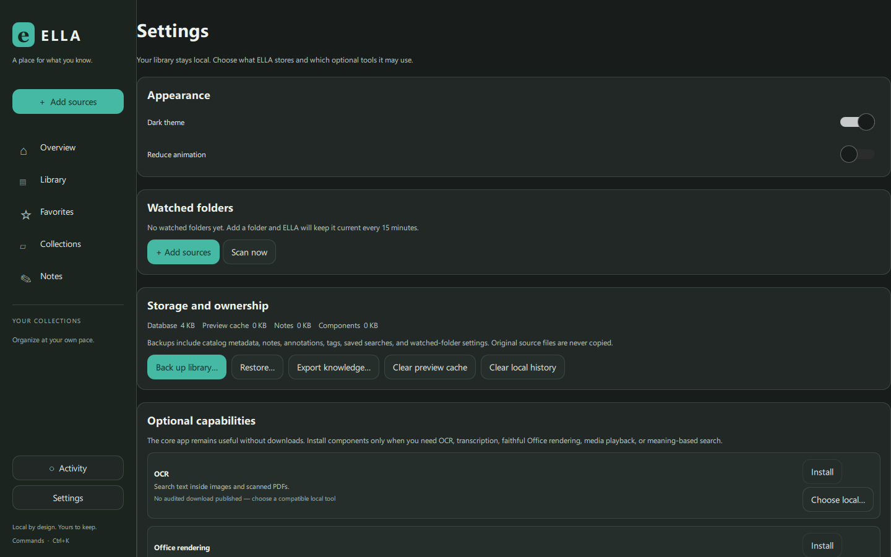

# ELLA visual walkthrough

This is the 90-second release demo path. It shows the core workflow without an
account or network connection.

1. Start ELLA and choose one or more folders. Review the supported-file count,
   exclusions, and estimated work before indexing.
2. Search for a remembered phrase or filename. Refine results by folder, type,
   tag, collection, or date, then save the search if it is useful again.
3. Select a result to inspect its strongest matching passage and why it matched.
   Open the passage at its page, paragraph, slide, text offset, or timestamp.
4. Highlight useful text and save it as a source-linked Markdown note. Reopen
   the source from the note backlink.
5. Open Settings to inspect storage, back up the catalog, export knowledge, or
   install an optional capability after reviewing its size.

## Screens

### Start

### Onboarding

### Library

### Reader

### Notes

### Settings and data ownership

